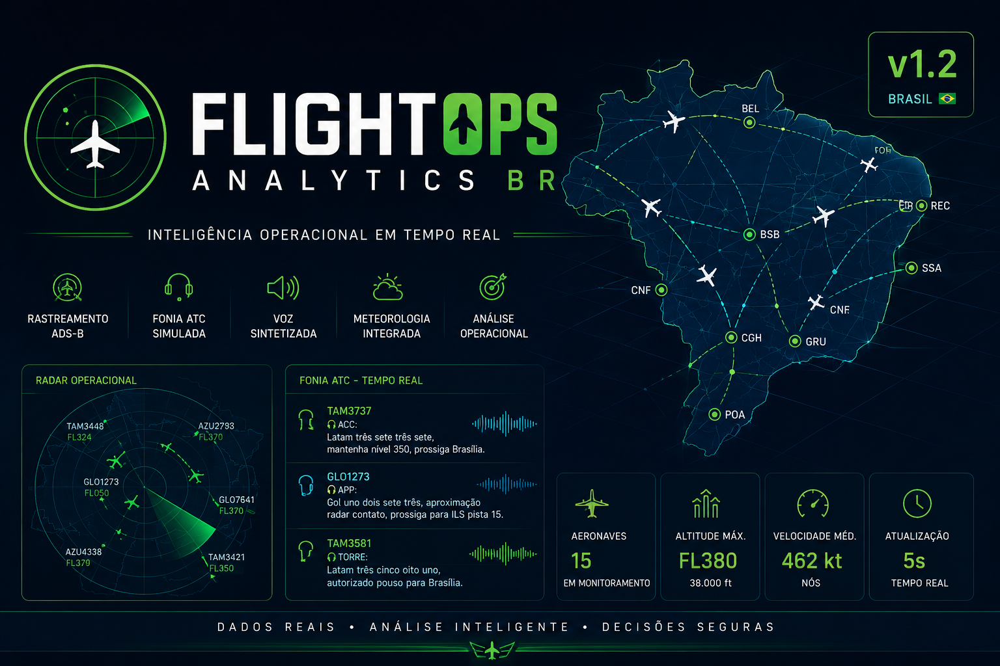

# ✈️ FlightOps Analytics BR v1.2

<p align="center">
  
</p>

<p align="center">


</p>

---

# Sobre o Projeto

O **FlightOps Analytics BR** é um sistema de monitoramento operacional aeronáutico desenvolvido em Python que integra dados ADS-B em tempo real, informações meteorológicas e recursos de visualização geoespacial para fornecer consciência situacional sobre o espaço aéreo brasileiro.

Mais do que um rastreador de voos, o projeto interpreta o contexto operacional de cada aeronave, identificando automaticamente sua fase de voo e gerando comunicações simuladas inspiradas na fraseologia utilizada pelo Controle de Tráfego Aéreo (ATC).

O objetivo é aproximar a experiência de monitoramento do ambiente encontrado em Centros de Controle de Área (ACC), Aproximação (APP) e Torres de Controle (TWR).

---

# Demonstração

O sistema é capaz de:

- acompanhar aeronaves em tempo real;
- desenhar rotas dinâmicas sobre o mapa;
- identificar automaticamente origem e destino;
- interpretar a fase operacional do voo;
- exibir informações meteorológicas;
- gerar fonia operacional contextual;
- reproduzir fonia utilizando voz sintetizada.

---

# Principais Funcionalidades

## Rastreamento em Tempo Real

- Recepção de dados ADS-B através da OpenSky Network;
- Monitoramento de aeronaves sobre o território brasileiro;
- Atualização automática das posições.

---

## Visualização Geográfica

- Mapa interativo utilizando Folium;
- Marcadores rotacionados conforme o rumo da aeronave;
- Popups informativos;
- Aeroportos nacionais cadastrados;
- Rotas desenhadas dinamicamente.

---

## Meteorologia

Integração com Open-Meteo:

- temperatura;
- velocidade do vento;
- condição meteorológica;
- tradução automática dos códigos meteorológicos.

---

## Inteligência Operacional

O sistema identifica automaticamente:

- subida;
- cruzeiro;
- aproximação;
- pouso.

Cada fase gera uma comunicação operacional específica.

---

## Simulação de Fonia

Geração automática de diálogos entre:

- Piloto
- Torre
- APP (Controle de Aproximação)
- ACC (Centro de Controle de Área)

Exemplo:

> 🎧 Centro Brasília, Azul dois oito uno dois, passando nível um zero zero, subindo para nível três seis zero.

---

## Voz Sintetizada

Implementação de voz utilizando Google Text-to-Speech (gTTS):

- leitura automática da fonia;
- conversão de callsigns para fraseologia brasileira;
- conversão de códigos IATA para nomes das cidades (ex.: BSB → Brasília).

---

## Monitoramento Inteligente

Possibilidade de selecionar voos específicos para:

- geração de áudio;
- monitoramento operacional;
- acompanhamento em tempo real.

---

# Tecnologias Utilizadas

- Python
- Pandas
- Requests
- Folium
- Google Colab
- OpenSky Network API
- Open-Meteo API
- gTTS
- IPython Display

---

# Arquitetura Geral

```
          OpenSky API
                │
                ▼
      Coleta de Dados ADS-B
                │
                ▼
       Processamento em Python
                │
      ┌─────────┼─────────┐
      ▼         ▼         ▼
 Meteorologia  Rotas   Inteligência
                │
                ▼
      Geração de Fonia
                │
                ▼
      Voz Sintetizada
                │
                ▼
      Visualização Folium
```

---

# Estrutura do Projeto

```
FlightOpsAnalytics/

│
├── main.ipynb
├── README.md
├── assets/
│      ├── banner.png
│      ├── mapa.png
│      └── screenshots/
│
├── audios/
│
└── docs/
```

---

# Fluxo Operacional

1. Consulta à OpenSky Network
2. Filtragem das aeronaves no Brasil
3. Consulta meteorológica
4. Identificação das rotas
5. Determinação da fase do voo
6. Geração automática da fonia
7. Síntese de voz
8. Exibição do mapa operacional

---

# Funcionalidades Implementadas

- ✔ Rastreamento ADS-B
- ✔ Mapa interativo
- ✔ Rotas dinâmicas
- ✔ Informações meteorológicas
- ✔ Conversão de WeatherCode
- ✔ Identificação da fase do voo
- ✔ Fonia operacional
- ✔ Voz sintetizada
- ✔ Conversão de callsign brasileiro
- ✔ Conversão IATA → Cidade
- ✔ Monitoramento seletivo de voos

---

# Roadmap

## Versão 1.3

- Movimento contínuo das aeronaves
- Atualização automática do mapa
- Replay operacional dos voos

## Versão 1.4

- Vozes masculinas e femininas
- Efeito de rádio VHF
- Fraseologia mais humanizada

## Versão 2.0

- Dashboard operacional
- Inteligência Artificial para geração contextual da fonia
- Predição de conflitos de tráfego
- Digital Twin do espaço aéreo brasileiro

---

# Objetivos do Projeto

Este projeto foi desenvolvido com finalidade:

- educacional;
- pesquisa;
- aprendizado de APIs;
- visualização geográfica;
- integração de sistemas;
- aplicações em Inteligência Artificial;
- simulação operacional aeronáutica.

---

# Autor

**Carlos Alberto Nunes (Beto Nunes)**

Tecnólogo em Marketing

Bacharel em Tecnologia da Informação

Pós-graduando em Informática na Educação

Desenvolvedor do projeto **FlightOps Analytics BR**

---

# Licença

Este projeto possui finalidade educacional e experimental.

